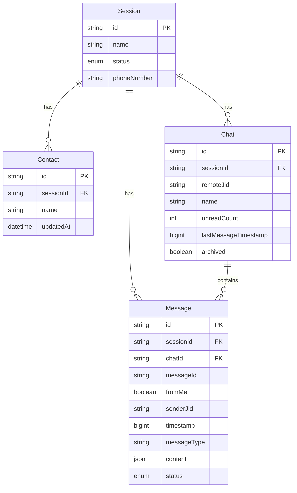

# Plano: Persistência de mensagens, chats e contatos do WhatsApp

## Objetivo
Criar estrutura completa no banco de dados para armazenar mensagens, chats e contatos do WhatsApp, capturando dados dos eventos `messages.upsert`, `chats.update/upsert` e `contacts.update/upsert`.

## Análise dos eventos (baseado nos logs)

### Evento `messages.upsert`
Contém:
- `key`: { remoteJid, fromMe, id, senderLid, senderPn }
- `messageTimestamp`
- `pushName`
- `message`: pode conter `conversation` (texto), `imageMessage`, `pollCreationMessageV3`, `pollUpdateMessage`, `interactiveMessage`, etc.

### Evento `chats.update`
Contém:
- `id`: identificador do chat (ex: "559981769536@s.whatsapp.net")
- `conversationTimestamp`
- `unreadCount`

### Evento `contacts.update`
Contém:
- `id`: identificador do contato
- `notify`: nome do contato

## Tarefas

### 1. Modelagem do schema Prisma
Adicionar ao `prisma/schema.prisma`:

#### Model Contact
- `id` (String, PK): JID do WhatsApp
- `sessionId` (String, FK): referência à Session
- `name` (String?): nome do contato (pushName/notify)
- `profilePicUrl` (String?): URL da foto de perfil
- `createdAt`, `updatedAt`
- Unique constraint: [sessionId, id]

#### Model Chat
- `id` (String, PK): UUID
- `sessionId` (String, FK): referência à Session
- `remoteJid` (String): identificador do chat no WhatsApp
- `name` (String?): nome do chat/grupo
- `unreadCount` (Int): contador de mensagens não lidas
- `lastMessageTimestamp` (BigInt?): timestamp da última mensagem
- `archived` (Boolean): se está arquivado
- `pinned` (Boolean): se está fixado
- `muted` (Boolean): se está silenciado
- `createdAt`, `updatedAt`
- Unique constraint: [sessionId, remoteJid]

#### Model Message
- `id` (String, PK): UUID
- `sessionId` (String, FK): referência à Session
- `chatId` (String, FK): referência ao Chat
- `remoteJid` (String): identificador do destinatário/remetente
- `messageId` (String): ID original da mensagem do WhatsApp
- `fromMe` (Boolean): se foi enviada pelo usuário
- `senderJid` (String?): JID do remetente (para grupos)
- `senderName` (String?): nome do remetente
- `timestamp` (BigInt): timestamp da mensagem
- `messageType` (String): tipo (conversation, imageMessage, videoMessage, etc.)
- `content` (Json): conteúdo completo da mensagem
- `status` (Enum): pending, sent, delivered, read, failed
- `isDeleted` (Boolean): se foi deletada
- `createdAt`, `updatedAt`
- Unique constraint: [sessionId, messageId]

#### Enum MessageStatus
- pending
- sent
- delivered
- read
- failed

### 2. Criar migration
Executar `npx prisma migrate dev --name add_messages_chats_contacts`

### 3. Criar módulo Messages
- Criar diretório `src/messages/`
- `messages.module.ts`
- `messages.service.ts`: serviço para CRUD de mensagens
- `messages.controller.ts`: endpoints para consultar mensagens

### 4. Implementar MessagesService
Métodos principais:
- `createOrUpdateContact(sessionId, contactData)`: upsert de contato
- `createOrUpdateChat(sessionId, chatData)`: upsert de chat
- `createMessage(sessionId, messageData)`: criar mensagem
- `updateMessageStatus(sessionId, messageId, status)`: atualizar status
- `getMessages(sessionId, chatId, filters)`: buscar mensagens com paginação
- `getChats(sessionId, filters)`: listar chats
- `getContacts(sessionId)`: listar contatos

### 5. Integrar com WhatsAppService
Modificar `src/whatsapp/whatsapp.service.ts`:

#### No método `registerMainEventListeners`:
- **messages.upsert**: processar e salvar mensagens + atualizar chat
- **messages.update**: atualizar status de mensagens
- **messages.delete**: marcar mensagem como deletada
- **chats.update/upsert**: atualizar/criar chat
- **contacts.update/upsert**: atualizar/criar contato

#### Injetar MessagesService:
```typescript
constructor(
  private prisma: PrismaService,
  @Inject(forwardRef(() => WebhooksService))
  private webhooksService: WebhooksService,
  @Inject(forwardRef(() => MessagesService))
  private messagesService: MessagesService,
) {}
```

### 6. Criar DTOs
Em `src/messages/dto/`:
- `get-messages.dto.ts`: filtros (chatId, limit, offset, dateFrom, dateTo)
- `get-chats.dto.ts`: filtros (unreadOnly, archived)
- `message-response.dto.ts`: formato de retorno

### 7. Criar endpoints no MessagesController
- `GET /messages/:sessionId/chats`: listar chats da sessão
- `GET /messages/:sessionId/chats/:chatId`: obter chat específico
- `GET /messages/:sessionId/chats/:chatId/messages`: listar mensagens do chat
- `GET /messages/:sessionId/contacts`: listar contatos

### 8. Tratamento de tipos de mensagem
Criar helper para extrair dados específicos por tipo:
- Texto: `conversation`
- Imagem: `imageMessage` → url, mimetype, caption
- Vídeo: `videoMessage`
- Áudio: `audioMessage`
- Documento: `documentMessage`
- Localização: `locationMessage`
- Contato: `contactMessage`
- Poll: `pollCreationMessageV3`, `pollUpdateMessage`
- Pagamento PIX: `interactiveMessage.nativeFlowMessage`

### 9. Otimizações
- Índices no banco:
  - Message: [sessionId, chatId, timestamp]
  - Chat: [sessionId, lastMessageTimestamp]
  - Contact: [sessionId, name]
- Batch inserts para mensagens em massa
- Transaction para operações relacionadas

### 10. Testes
- Testar recebimento de mensagens de texto
- Testar recebimento de mídias
- Testar atualização de status (lido/entregue)
- Testar deleção de mensagens
- Verificar performance com volume alto

## Diagrama de relacionamentos



## Considerações
- Armazenar conteúdo completo em JSON permite flexibilidade para novos tipos
- Usar BigInt para timestamps (formato Unix em milissegundos)
- Implementar soft delete para mensagens
- Considerar retenção de dados (política de limpeza)
- Logs detalhados já estão implementados para debug